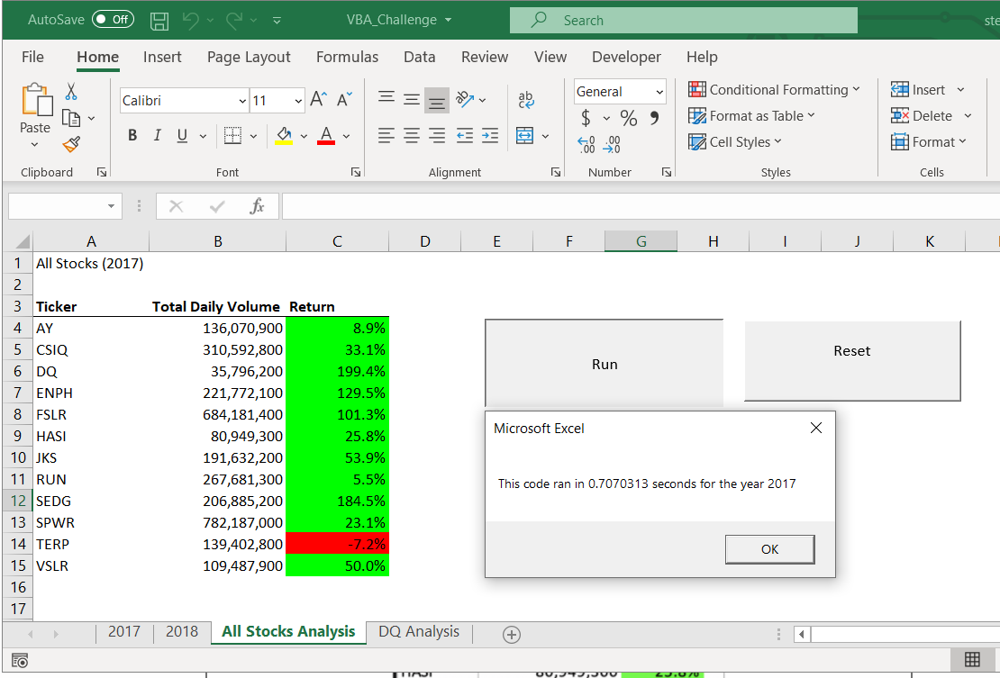
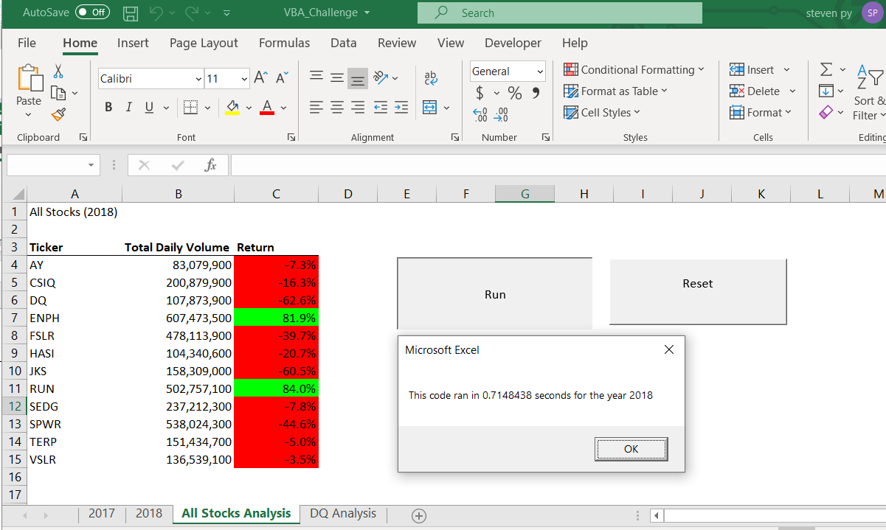

# VBA_Stock_Analysis
### VBA Project

## Purpose

The purpose of this project is to use the VBA macros on Excel to perform analysis on stock dataset. I learned how to create arrays, use loops, run macros, and display result in Excel. By using macros we are able to save time and allow the Excel to calculate the requested analysis. Macros are a efficient tool to help provide solutions/analysis. 

## Result

The 2017 stock analysis result was outstanding. Only one stock failed to make profit which was TERP. The highest performing stock was DQ with return of 199.4%.  

The 2018 stock analysis result was poor. Only two stock was profitable which was ENPH and RUN. The worst performing stock was DQ at -62.6%. 

## Summary

The advantages of using the refactoring is that it improves finding bugs, program faster, and make software easier to understand. The disadvantages is using refactoring codes that are not tested which could introduce bugs to your project. The refactoring codes used in this project help keep the code organized and easy to understand. The advantages of the original refactoring scripts for VBA is that it improves readability and lessens the complexity.
